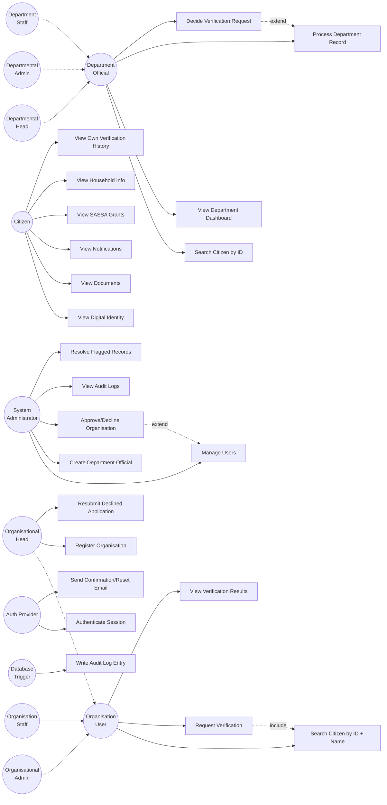

# UbuntuID — Actors & Use Cases

Source material for a UML use case diagram. Every use case listed here
maps to a real screen, repository method, or RPC in the codebase (`lib/`)
— this is not aspirational; where a use case reflects an *intended*
permission that has no dedicated screen built yet, it's marked
**(intent only)** and cross-referenced to `docs/KNOWN_LIMITATIONS.md` or
`docs/FUTURE_WORK.md`.

## 1. Actors

### Primary (human) actors

| Actor | Generalises from | Notes |
|---|---|---|
| **Citizen** | — | Any person with a UbuntuID citizen record |
| **Department Official** | — | Base role for all 8 departments' staff |
| ↳ Departmental Head | Department Official | 1 per department |
| ↳ Departmental Admin | Department Official | 1 per department |
| ↳ Department Staff | Department Official | 2 per department |
| **Organisation User** | — | Base role for approved-organisation staff |
| ↳ Organisational Head | Organisation User | The account that registered the org |
| ↳ Organisational Admin | Organisation User | |
| ↳ Organisation Staff | Organisation User | |
| **System Administrator** | — | 4 named UbuntuID platform admins |

### Supporting (system) actors

| Actor | Role |
|---|---|
| **Auth Provider** (Supabase Auth / GoTrue) | Authenticates credentials, issues sessions, sends confirmation/reset emails |
| **Database Trigger** | Writes `audit_logs` automatically on insert/update/delete of a monitored table — no human or UI actor ever writes an audit log directly |

Department Officials and Organisation Users are further specialised by
which department/organisation they belong to (e.g. a SAPS Departmental
Head vs a DHA Departmental Head) — those don't change the *use case*, only
which department-specific records the generic use cases operate on, so
they aren't drawn as separate actors below; the department-specific use
cases in §2.2 are what varies.

---

## 2. Use Cases by Actor

### 2.1 Citizen

- Register for an account
- Log in / Log out
- Reset / recover password
- View dashboard (identity status, quick actions, recent activity)
- View digital identity (own credentials list)
- View documents (list and detail)
- View notifications (list and detail); mark a notification as read
- View personal information / profile
- View SASSA grants
- View household / property information
- View verification requests and results concerning themselves *(read-only — a citizen never decides a request)*
- Manage account settings (security, privacy, notification preferences)

*Explicitly not a citizen use case: upload a document, submit a SASSA/housing/job application, or decide a verification request — all deliberately out of scope (`docs/PROJECT_SCOPE.md`).*

### 2.2 Department Official (base use cases — all 8 departments, all 3 tiers)

- Log in / Log out
- View department dashboard (pending/processed counts, active officials, department-specific stats)
- Search for a citizen by ID number
- View department services (the credential types this department issues)
- View colleagues (fellow officials in the same department)
- View verification requests routed to this department
- Decide a verification request (approve / reject)
- View own profile

#### Departmental Head *(extends Department Official)*
- Approve/reject department-level actions with final authority **(intent only** — the app's decide-a-verification-request use case is shared across all tiers today; a Head-only override is not separately gated in the UI, see `docs/KNOWN_LIMITATIONS.md`)

#### Departmental Admin *(extends Department Official)*
- Create/update/deactivate department staff accounts **(intent only** — no in-app departmental self-service staff screen exists; all official accounts are created by a System Administrator)

#### Department Staff *(extends Department Official)*
- Create/update day-to-day departmental records (see per-department use cases below) — cannot deactivate accounts or manage other staff

#### Department-specific record use cases (extend "Search for a citizen" / department dashboard)

| Department | Use cases |
|---|---|
| Home Affairs | Register a new citizen · Record a marriage · Record a death · Issue/update a passport |
| Transport | Issue/update a driver's licence · Register a vehicle |
| National Treasury (SARS) | Register a taxpayer · Record a tax return · Update tax compliance status |
| Police (SAPS) | Search a citizen for clearance · Record a criminal case · Issue a clearance certificate |
| Basic Education (DBE) | Record an NSC (matric) result |
| Higher Education (DHET) | Record student enrolment · Record NSFAS funding |
| Social Development (SASSA) | Create/update a grant record |
| Employment and Labour | Record employment/UIF status |

### 2.3 Organisation User (base use cases — all 3 tiers)

- Log in / Log out
- View organisation dashboard (verification stats, application status)
- Search for a citizen by **ID number + first name + last name** (all three must match)
- Select credentials to verify, narrowed to the organisation's approved scope
- Request verification of a citizen's credential(s)
- View verification requests raised by the organisation and their results
- View own profile

#### Organisational Head *(extends Organisation User)*
- Register the organisation (submit legal details, contact info, and the credential-type scope the organisation needs)
- View the organisation's application status (pending / approved / declined)
- Resubmit a declined application with updated details/scope

#### Organisational Admin *(extends Organisation User)*
- Manage the organisation's own user accounts **(intent only** — `is_org_admin()` currently checks a role that Heads aren't seeded with; see `docs/KNOWN_LIMITATIONS.md`)
- Manage day-to-day integration settings **(intent only)**

#### Organisation Staff *(extends Organisation User)*
- Operate within the organisation's approved scope only — no user-management rights

### 2.4 System Administrator

- Log in / Log out
- View system-wide dashboard (platform stats)
- Search / list / view any user account across all roles (citizens, department officials, organisation users, other admins)
- Activate / deactivate any user account
- Create a department official account (auto-generates login email + department-domain employee reference)
- Edit a department official's details
- View / manage departments (activate/deactivate)
- View / manage organisations
- **Approve an organisation's registration application**
- **Decline an organisation's registration application** (with a reason)
- View the system-wide verification queue
- Decide any verification request (cross-department override)
- Search citizens (unrestricted)
- View and resolve flagged records
- View audit logs (list and detail)
- View own profile

### 2.5 Auth Provider (supporting actor)

- Authenticate a login attempt
- Issue and refresh a session
- Send an email confirmation link on sign-up
- Send a password-reset link

### 2.6 Database Trigger (supporting actor)

- Write an `audit_logs` row automatically whenever a monitored table is inserted, updated, or deleted

---

## 3. Key `<<include>>` / `<<extend>>` relationships

For drawing the diagram:

- **Request Verification** `<<include>>` **Search for a Citizen** and **Select Credentials to Verify** (Organisation User)
- **Register the Organisation** `<<include>>` **Log in / Log out**'s sibling, *Create an Account* (via the Auth Provider) — a registration always starts by creating an auth account first
- **Decide a Verification Request** `<<extend>>`s **View Verification Requests** (Department Official, System Administrator)
- **Approve / Decline an Organisation Application** `<<extend>>`s **View / Manage Organisations** (System Administrator)
- Every per-department record use case in §2.2's table `<<extend>>`s **Search for a Citizen**
- **Send Email Confirmation Link** and **Send Password-Reset Link** (Auth Provider) `<<include>>` into **Register for an Account** / **Reset Password** respectively
- **Write Audit Log Entry** (Database Trigger) `<<extend>>`s essentially every create/update/delete use case above — it is never invoked directly by an actor

---

## 4. Diagram (Mermaid — view in an editor that renders Mermaid, e.g. VS Code with the Mermaid extension, or GitHub)

